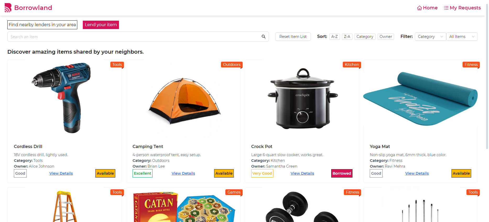
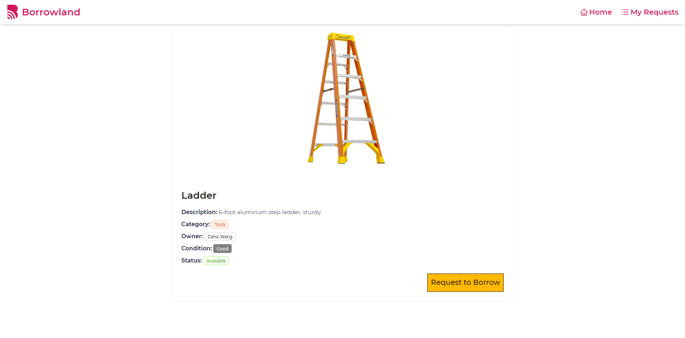
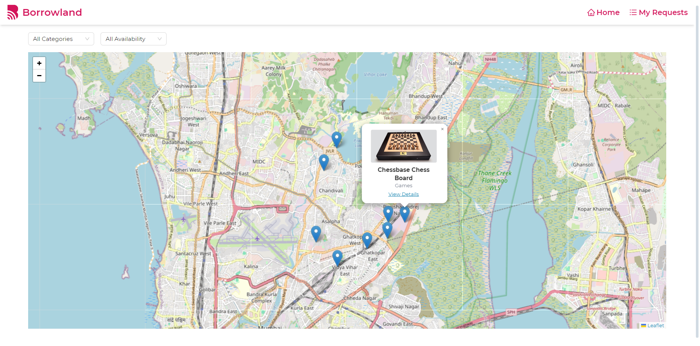

# 🏘️ Borrowland – Neighborhood Resource Sharing App

Borrowland is a modern and intuitive React.js web application designed for local communities to lend and borrow household items such as tools, appliances, books, and more. The platform promotes sustainability and community bonding through a sleek and interactive user interface, all powered by frontend logic using React state and localStorage.

## 🚀 Live Demo

🌐 [Live Site](https://borrowland-gules.vercel.app)  
🔗 [GitHub Repository](https://github.com/JiteshBalani/advantageAI.git)

---

## 📸 Screenshots

> 




---

## 🛠️ Tech Stack

- **Frontend**: React 19, React Router 7, Tailwind CSS 4
- **UI Components**: Ant Design 5
- **Mapping**: Leaflet + React-Leaflet
- **Build Tool**: Vite 7
- **State Management**: React Hooks
- **Persistence**: localStorage
- **Routing**: React Router DOM v7
- **Deployment**: Vercel

---

## 📂 Project Structure

    src/

        ├── components/ # Reusable UI components (e.g. Header)

        ├── pages/ Homepage, Item page, AddItem, MapView, etc.

        ├── assets/ # Static assets (logo, images)

        ├── App.jsx # Main app router and layout

        └── main.jsx # Entry point

---

## ✅ Features Implemented

### 🔹 Core Features
- ✅ **Home Page** – View searchable, sortable, filterable catalog of available items
- ✅ **Item Details Page** – View detailed information and mock borrow option
- ✅ **Add New Item** – Form with validation and mock submission
- ✅ **Mark as Borrowed** – Updates item availability and reflects visually
- ✅ **404 Not Found** – Friendly error message with navigation

### 🔸 Bonus Features
- 🎯 **Map View** – View item locations on a clustered Leaflet map
- 🎯 **My Requests Page** – Track borrow requests and statuses (mock)
- 🎯 **Persistent Storage** – Uses localStorage to store items & requests
- 🎯 **Pagination & Filters** – Catalog pagination and filter by category/availability

---

## 🧪 How to Run Locally

### Prerequisites

- Node.js (latest stable version recommended)
- Git

```bash
# Clone the repo
git clone https://github.com/JiteshBalani/advantageAI.git
cd advantageAI

# Install dependencies
npm install

# Start the development server
npm run dev
```

---

Developed by [Jitesh Balani](https://github.com/JiteshBalani)